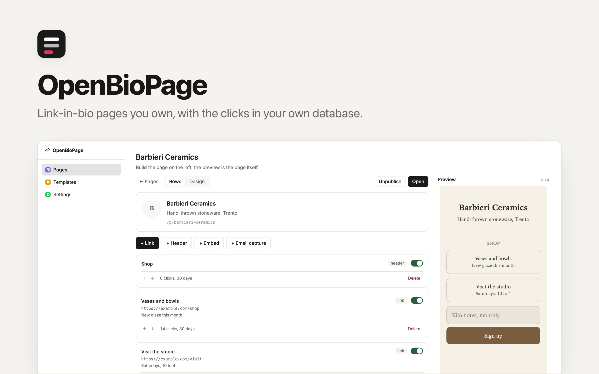

<p align="center">
  <picture>
    <source media="(prefers-color-scheme: dark)" srcset="./readme-banner-dark.png">
    
  </picture>
</p>

# OpenBioPage

Link-in-bio pages you own — where the **click history is a table in your own database**, not a chart you rent back from a vendor.

One install holds every page you run. An agency puts one page per client, each on that client's own domain, signed in the footer with the agency's name. A single person runs one page and ignores the rest.

An open-source app template provided by [Clawnify.com](https://clawnify.com). An alternative to Linktree, Beacons, Bio.link and Campsite.

## Why this exists

A link page is three lines of HTML. Nobody pays for the page — they pay for what accrues around it, and then they can't take it with them.

Two years of "which post actually sent people to the shop" lives in someone else's dashboard, exported as a CSV if you're lucky. The page is trivial and the history is the asset, so the history is what gets held.

So the redirect is the product:

```
visitor taps a row  →  /r/{block}  →  a row written here  →  302 to the destination
                                        │
                                        └── your table: which link, when, from
                                            which referrer, in your database
```

Every link is served through a counting redirect, so the record is yours before it is anyone's. You can query it, join it to your own data, and keep it when you stop using this.

The second thing it buys: the pages tell you when they rot. A checker walks every link and stores what it answered, and the overview sorts stalest first. Dead invites and 404'd shop links stop being something a client tells *you* about.

## What it does

- **Many pages, one install.** Each on its own custom domain, each with its own look, all in one place with one overview.
- **A page anyone can build.** Drag a row to reorder it, or use the arrows — both are there, because a list that can only be reordered by dragging cannot be reordered from a keyboard at all. Create it, add rows, retitle them in place, reorder, hide one without losing its click history, pick a template, publish. The real page sits beside the editor and updates on every save, so the confirmation that a change worked *is* the change.
- **Paste a URL and the row fills itself in.** The destination's own title and image come back from its meta tags — a fetch, not a model call and not a screenshot. The image is copied into this app's own storage, so a page with ten thumbnails still makes zero requests to anyone else, and still tells nobody who is reading it.
- **Eight templates, then your brand on top.** `mono`, `ink`, `paper`, `sunset`, `brutal`, `slate`, `candy`, `forest` — each a whole look, with its own typeface, button treatment, corner and canvas.
- **A photograph can be the page.** Upload one and the header becomes a hero: the image full-bleed, the name over it.
- **A page is also a business card.** Fill in the contact details and a
  **Save contact** row hands over a vCard the phone opens in its contacts app,
  with a QR code pointing at the page for the printed side. The code is
  generated as SVG, so it prints at any size and costs no image request.
- **A socials row that still counts.** A line of platform marks under the links,
  each one going through the same counting redirect, so a tap on Instagram is
  recorded with the platform beside it rather than vanishing into a bare
  `<a href>`.
- **Email capture that lands here.** Addresses go into your own table, not a vendor's list.

## Templates are documents, not dropdowns

Every look downloads as markdown — the fields in a frontmatter block, then prose saying what the look is for and which of its rules are load-bearing:

```markdown
---
slug: paper
name: Paper
background: "#f6f1e7"
font: serif
button: outline
---

# Paper

Rules that matter:
- The buttons never fill. A filled button on this ground reads as a
  web form dropped into a book.
```

Edit it yourself or hand it to an agent — *"make this colder", "this is for a law firm"* — paste it back, and your pages can wear it. The prose round-trips untouched, so the reasoning outlives the person who had it.

## Contrast is not left to taste

Button text colour is computed from the accent rather than authored, and every template is tested against WCAG AA for body text, subtitle and button label. The first `sunset` gradient looked lovely and measured **2.32:1**; the test is why it is not the one that shipped.

A photograph defeats measurement — the next upload is a white sky where the last was a dark wall — so the guarantee moves to the layer the app controls. It solves for the scrim opacity at which the *worst possible pixel* still clears 4.5:1, and refuses anything lighter. You can go darker; you cannot go thinner.

## No JavaScript on the public page

One self-contained HTML document. No web font, no external stylesheet, no analytics beacon, no request to any other host. It renders on the first paint in an in-app browser on a bad connection, which is where link pages are actually opened.

That constraint is why the typefaces are system stacks and the gradients are CSS, and why a link thumbnail is copied here rather than hotlinked.

## What is here

| Path | What it is |
|---|---|
| `/` | The overview: every page with its staleness, broken links and clicks |
| `/pages/{id}` | The editor, with the live page beside it |
| `/templates` | The gallery; download any look as markdown |
| `/p/{slug}` | The public page. Plain HTML, server rendered |
| `/r/{block}` | The counting redirect every link goes through |
| `/p/{slug}/contact.vcf` | The contact card, as vCard |
| `/p/{slug}/qr.svg` | A QR code pointing at the page |
| `/api/…` | The full API, documented at `/api/openapi.json` and `/llms.txt` |

A page is a list of blocks, and `kind` decides how each one renders:

| kind | Renders as |
|---|---|
| `link` | A button. The only kind whose clicks are counted |
| `header` | A quiet caption that groups the rows under it |
| `embed` | An inline player. YouTube and Spotify today |
| `email` | A signup field that posts to this app |
| `socials` | A row of platform marks, each counted separately |
| `contact` | A button that hands over the page's contact card |

## Local development

Requires Node 22+ and pnpm.

```bash
pnpm install
pnpm dev          # UI on :5173, API on :8792
```

`pnpm dev` applies `schema.sql` to a local database and runs the UI and the API together. The dev server supplies an organisation header so the authenticated routes work on a fresh clone.

```bash
pnpm test         # contrast rules, the template round trip, the metadata parser
pnpm typecheck
pnpm build
```

## Deploy

```bash
npx clawnify deploy
```

Or use the button in the [Clawnify app directory](https://app.clawnify.com). Each deployment gets its own database and file storage — the pages, the subscribers and the click history stay inside your own organisation.

## Extending it

- **A new template** is one entry in `src/server/theme.ts`, or a markdown document posted to `/api/templates`. The contrast tests run over every one automatically, so a look that cannot be read never merges.
- **A new block kind** is a `kind` value plus a branch in `renderBlock` — the editor picks it up from the same list.
- **The link checker** stores a status per row rather than a boolean, so "410 gone" and "429 rate limited" can be told apart later without a migration.
- **Deliberately absent:** a hosted analytics dashboard. The clicks are a table; use your own tools on it. That is the point of keeping them.

## Licence

MIT.
